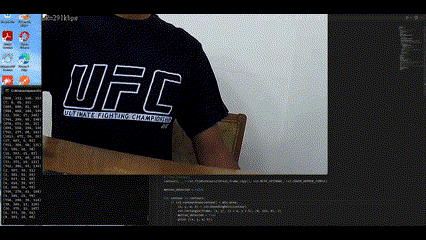

# motion-detection-python-rtsp-AI

    Author
    Nay Oo Kyaw
    nayookyaw.nok@gmail.com

[About]
This project is to detect motion using "rtsp" live stream  
I used python to detect motion from live stream camera  
There are a lot of other libraries to detect motion (e.g ffmpeg cmd line)  
I developed python codes because to get more control under myself  

[Demo]

[DemoVideo]

[Note]

